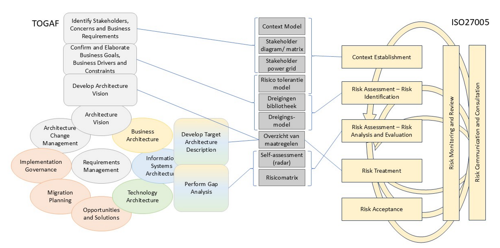

# 6 - Het managen van soevereiniteitsrisico’s

## 6.1 Inleiding
Dit hoofdstuk geeft organisaties een aanzet voor een systematische aanpak om met digitale soevereiniteitsvraagstukken om te gaan. De aanpak bestaat uit een aantal concrete processtappen, met concrete hulpmiddelen als input en deliverables als output. De focus ligt in de aanpak op de analyse- en besluitvormingsfase. Digitale soevereiniteit vraagt daarbij niet om een eenmalige beoordeling, maar een cyclisch proces waarin context, dreigingen, risicotolerantie, maatregelen en restrisico’s periodiek worden herijkt.

In tegenstelling tot het ontwikkelen van een volledig eigen model, is heel sterk gekeken naar bestaande methoden om op voort te bouwen.  Er is daarbij bewust aangesloten op het standaard raamwerk voor risicobeheersing ISO/IEC 27005:2022 en op TOGAF voor architectuur. SABSA is gebruikt als inspiratiebron voor het expliciet verbinden van businessdoelen, risico’s en architectuurkeuzes. Het is niet als formeel procesmodel overgenomen, maar sluit aan bij de stelling dat architectuur traceerbaar moet bijdragen aan businessdoelstellingen en risicobeheersing. Dit alles geeft digitaalkundig architecten de gelegenheid tot inbedding en aanpassing van het beschrevene in de werkwijze van hun eigen organisatie.

Het raakvlak tussen een risicobeheersingsmethode en digitale architectuur bestaat er uit dat risico-informatie gevolgen kan hebben voor ontwerpkeuzes. Riskmanagement levert inzicht in risico's, restrisico's en risicobereidheid: digitale architectuur vertaalt deze naar principes, ontwerpcriteria en governance mechanismen. Dit vergt uiteraard afstemming en samenwerking met stakeholders over prioriteiten, haalbaarheid, en restrisico’s.

Dit hoofdstuk kiest bewust voor een enterprise-architectuur invalshoek, om ook de situatie te omvatten dat belangen en impact op het (hoogste) bestuurlijke niveau geadresseerd moeten worden. Digitale soevereiniteit is immers te zien als een architectuuraspect, dat op alle architectuurlagen beschouwd moet worden. Volgens TOGAF moet dat al worden geadresseerd in de fase “Architecture Vision,” door daarin de concrete dreigingen, te beschermen belangen (use cases), risicotolerantie en de business doelen voor digitale soevereiniteit expliciet te maken.

Een tweede belangrijk aandachtsgebied bestaat uit de samengestelde fase voor het bepalen van de doelarchitectuur (die in dit document de Business Architecture, Information, Data, Technology Architecture fasen omvat). Daarin gaat het om het verder concretiseren van risico’s en de vertaling naar te nemen maatregelen in de architectuur.
Uiteraard zijn implementatie-evaluatie, continue analyse van dreigingen en risico’s, en bijstelling van doelen en acties relevant:

Digitale soevereiniteit vereist een cyclische aanpak voor risicoanalyse, het bepalen en realiseren van doelen, en implementatie-evaluatie.
{: .call-out }

Dit sluit aan bij zowel ISO 27005 als TOGAF: TOGAF ADM heeft een voor architecten bekend, cyclisch karakter, en ISO 27005 ondersteunt binnen hetzelfde raamwerk zowel kortere cycli (zoals iteratieve risicoclassificatie en uitwerking van maatregelen) als langere cycli (van hernieuwde vaststelling van een bedrijfscontext tot en met formele acceptatie).

## 6.2 Overzicht
De onderstaande figuur geeft links de TOGAF Architecture Development Method en rechts de hoofdstappen van risicobeheersing conform ISO 27005. Bij de TOGAF ADM cyclus zijn de concrete architectuurtaken benoemd die ook relevant zijn voor risicobeheersing. In de risicobeheersingscyclus kunnen producten worden gebruikt die uit de architectuurcyclus kunnen volgen, of die in samenwerking worden opgesteld. Deze producten zijn hier ingetekend met de mogelijke, expliciete verbinding tussen beide cycli.

Het volgende hoofdstuk en de bijlagen bij deze whitepaper bevatten omschrijvingen en sjablonen voor deze producten.

ISO 27005 is een raamwerk dat zich richt op risicobeheersing binnen het domein informatiebeveiliging. Net als TOGAF laat het ruimte voor nadere methodische invulling. Het proces en de daarin gebruikte producten zijn daarmee prima algemener toe te passen, inclusief voor het oplossen van digitale soevereiniteitsvraagstukken.

De paragrafen hierna beschrijven de doelen en typische taken per fase van de risicobeheersingscyclus conform ISO 27005. Elke fase bevat ook een lijstje van de architectuurproducten die een hulpmiddel kunnen zijn in de fase. De hulpmiddelen zelf zijn toegelicht in het volgende hoofdstuk.

De in de volgende paragrafen beschreven fasen vormen de kern van een risicobeheersingscyclus in ISO 27005.  Deze zijn:

* Context Establishment
* Risk Assessment – Risk Identification
* Risk Assessment – Analysis and Evaluation
* Risk Treatment
* Risk Acceptance

De verwijzingen naar zowel TOGAF als ISO 27005 zijn om reden van herkenbaarheid in het Engels opgenomen.

## 6.3 Context Establishment
In deze fase worden de voorwaarden ingevuld om de rest van de risicobeheersing goed te laten verlopen, zoals:

* Bepaal missie, waarden, doelen en prioriteiten
* Bepaal te beschermen belangen en niet-acceptabele uitkomsten
* Bepaal kritische bedrijfsdomeinen
* Bepaal verplichtingen en voorwaarden (juridisch, compliance, …)
* Bepaal de risicobeheersingsopdracht
* Identificeer beslissers
* Bepaal risicotolerantie
* Bepaal governance
* Identificeer risicoeigenaren voor systemen, diensten en andere assets

In relatie tot digitale soevereiniteit betekent dit, dat de stakeholders en te vermijden bedreigingen voor dit onderwerp expliciet moeten worden bepaald. Ook dient de scope en het doel van mogelijke initiatieven op voorhand afgestemd te zijn, zodat er in latere fasen draagvlak voor inzet van bedrijfsmiddelen is. Het is bij een uitbreiding van de beschouwing van risicotypen immers niet vanzelfsprekend, dat bestaande stakeholders een uitbreiding van hun verantwoordelijkheden zullen accepteren.

Hulpmiddelen:

* Model voor risicotolerantie – input voor de in deze fase te bepalen risicotolerantie
* Context Model – output van deze fase
* Stakeholder Diagram/Matrix - output van deze fase
* Stakeholder Power Grid – output van deze fase

## 6.4 Risk Assessment – Risk Identification
Dit is de eerste analysefase om te komen tot concrete risicobehandeling. Deze fase wordt uitgevoerd voor de scope die in de voorliggende fase is gedefinieerd, op grond van de hiervoor aangewezen (interne) assets, dan wel de gekozen (externe) bedreigingen. Hierin horen taken zoals:

* Begrijp de dreigingen uit de omgeving
* Identificeer externe actoren en beperkingen/afhankelijkheden daarvan
* Begrijp de scope en aard van risico’s
* Begrijp hoe risico’s evolueren
* Bepaal relaties naar andere typen risico’s
* Bepaal benodigde soorten beheersmaatregelen (controls)

De eerste twee items zijn hier expliciet genoemd, omdat digitale soevereiniteit een ‘outside in’ blik vereist.
Een goed risicobegrip is voor digitale soevereiniteit zeer relevant. Enerzijds omdat afhankelijkheden overal kunnen zitten in procesketens of in technology stacks. Potentiële maatregelen kunnen dus behoorlijk fundamenteel van aard zijn. Anderzijds omdat het aanpassen van eerdere, fundamentele keuzen nieuwe risico’s kan introduceren. Ook die moeten worden beschouwd.

Hulpmiddelen:

* Dreigingenbibliotheek– input voor de in deze fase te bepalen risico's
* Dreigingsmodel – input voor de in deze fase te bepalen risico's

## 6.5 Risk Assessment – Analysis and Evaluation
ISO 27005 kent na risicoidentificatie twee fasen die we hier samennemen: analysis en evaluation. In de analysefase worden per risico kans en mogelijke gevolgen bepaald. In de evaluatiefase wordt daaraan met stakeholders een classificatie verbonden, en bepaald welke risico’s opvolging krijgen. Typische taken zijn:

* Identificeer en classificeer risico’s
* Bepaal restrisico’s
* Definieer aanbevelingen

Nadat in de volgende fase beheersingsmaatregelen zijn bepaald, wordt deze fase herhaald ter beoordeling van de restrisico’s, net zolang tot het geheel aan maatregelen leidt tot acceptabele risiconiveaus.

Hulpmiddelen:

* Self-assessment (radar) - output van deze fase, een manier voor visualisatie van restrisico's
* Risicomatrix – output van deze fase voor risicoclassificatie

## 6.6 Risk Treatment
In deze fase worden de risicobeheersingsmaatregelen bepaald en geïmplementeerd. Typische taken binnen deze fase zijn:

* Definieer beheersmaatregelen en toetsing ervan (controls assurance)
* Implementeer beheersmaatregelen
* Implementeer toetsing van beheersmaatregelen
* Beoordeel de beheersmaatregelen baseline en werk bij
* Beoordeel de beheersmaatregelen toetsing baseline en werk bij
* Review aanwezige beheersmaatregelen
* De beheersmaatregelen dienen niet alleen het primair onderkende risico te adresseren, ook hun effectiviteit moet (idealiter) kunnen worden bepaald door toetsing ervan (controls assurance).

Hulpmiddel:

* Overzicht van maatregelen – input voor de in deze fase te bepalen risicobeheersingsmaatregelen

## 6.7 Risk Acceptance
Risk acceptance is de formele fase waarin wordt vastgesteld of de overblijvende risico’s, na analyse en eventuele risicobehandeling, acceptabel zijn binnen de eerder vastgestelde risicotolerantie. Voor digitale soevereiniteit is dit een cruciaal besluitmoment, omdat het vaak gaat om afhankelijkheden die niet volledig kunnen worden weggenomen. Een organisatie kan bijvoorbeeld bewust blijven werken met een dominante cloudleverancier, een buitenlandse platformdienst, een leveranciersspecifieke technologie of een ketenafhankelijkheid, mits duidelijk is welke risico’s daarmee samenhangen en waarom deze binnen de gekozen context acceptabel zijn.

Risicoacceptatie betekent niet dat een risico wordt genegeerd. Het betekent dat expliciet wordt vastgesteld:

* welk restrisico overblijft
* wie daarvoor verantwoordelijk is
* onder welke voorwaarden dit risico wordt geaccepteerd
* wanneer het opnieuw moet worden beoordeeld

Hiermee wordt voorkomen dat digitale-soevereiniteitsrisico’s impliciet ontstaan of in projecten blijven hangen als onopgeloste aandachtspunten.

Voor digitaalkundige architecten is deze fase vooral van belang omdat zij de verbinding leggen tussen risicoanalyse, architectuurkeuzes en bestuurlijke besluitvorming. De architect maakt inzichtelijk welke afhankelijkheden en restrisico’s voortkomen uit de gekozen architectuur, welke alternatieven of maatregelen beschikbaar zijn, en wat de consequenties zijn van accepteren, mitigeren, vermijden of delen van risico’s.

Risk acceptance vormt als fase daarmee niet alleen het einde van een iteratie, maar ook het startpunt voor monitoring en herijking. Wanneer omstandigheden veranderen — bijvoorbeeld door gewijzigde wetgeving, geopolitieke ontwikkelingen, leveranciersbeleid, prijsstelling, technische afhankelijkheden of incidenten — kan een eerder geaccepteerd risico opnieuw buiten de risicotolerantie vallen. In dat geval moet de cyclus opnieuw worden doorlopen.

De formele acceptatie zelf ligt echter bij de daarvoor aangewezen risico-eigenaar, business eigenaar, directie of bestuurlijke opdrachtgever.

## 6.8 Doorlopende fasen: Communication and Consulting, Monitoring and Review
De hiervoor beschreven fasen vormen de kern van de risicobeheersingscyclus. Daarnaast kent ISO 27005 twee doorlopende activiteiten die voor digitale soevereiniteit van bijzonder belang zijn:

* Communication and consulting: gericht op de stakeholders voor continue betrokkenheid en besluitvorming en nodig omdat digitale soevereiniteit zelden uitsluitend binnen het mandaat van de architectuurfunctie valt.
* Monitoring and review: een bewakingsfunctie op alles wat in de overige fasen gebeurt zoals de effectiviteit van aanwezige beheersmaatregelen, het initiëren van onafhankelijke reviews/audits en op nieuwe ontwikkelingen die aanleiding geven tot een nieuwe risicobeheersingscyclus. Het is nodig omdat digitale-soevereiniteitsrisico’s in de tijd veranderen. Afhankelijkheden kunnen toenemen door uitbreiding van platformdiensten, wijziging van leveranciersvoorwaarden of -strategie , geopolitieke verhoudingen kunnen verschuiven, wet- en regelgeving kan veranderen en nieuwe technologieën kunnen bestaande architectuurkeuzes onder druk zetten. Wat op het moment van besluitvorming acceptabel is, kan daardoor later alsnog buiten de vastgestelde risicotolerantie vallen. Het  moet daarmee onderdeel worden van reguliere architectuurreviews, risicomanagement, sourcingevaluaties, portfoliosturing en strategische herijking.  Het richt zich daarom niet alleen op de vraag of afgesproken maatregelen zijn geïmplementeerd, maar ook op de vraag of zij nog voldoende effectief zijn.

Deze activiteiten zijn geen losse afsluitende stappen, maar lopen door het hele proces heen.

Zonder expliciete communicatie en consultatie bestaat het risico dat digitale soevereiniteit een technische analyse blijft, terwijl de feitelijke keuzes over risicotolerantie, prioriteiten, investeringen en acceptatie van restrisico’s bestuurlijk moeten worden gemaakt. Het onderwerp moet daarmee onderdeel worden van reguliere architectuurreviews, risicomanagement, sourcingevaluaties, portfoliosturing en strategische herijking.

Typische taken in deze doorlopende fasen zijn:

* Het organiseren van afstemming met diverse relevante stakeholders.
* Opvolging van wijzigingen in leveranciers, contracten, technologie, jurisdicties, wetgeving en ketenrelaties.
* Periodiek toetsing of genomen beheersmaatregelen nog effectief zij en restrisico’s nog binnen de vastgestelde risicotolerantie vallen.
* Vastlegging van besluiten, uitzonderingen en geaccepteerde restrisico’s.
