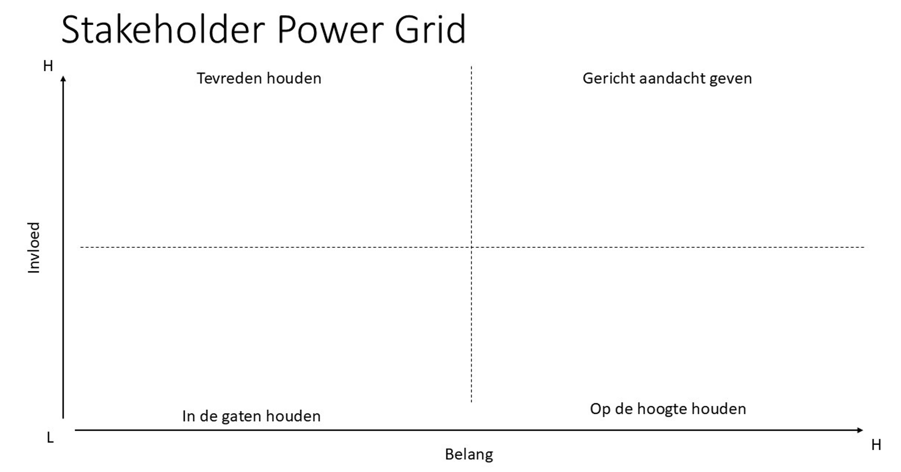
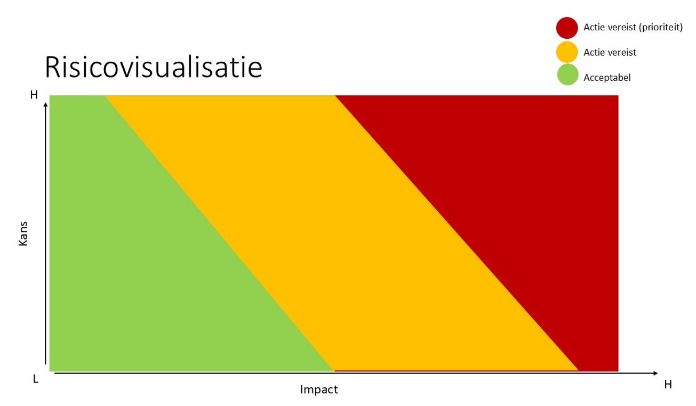

# 7 - Hulpmiddelen voor de architect

## 7.1 Dreigingenbibliotheek
Een overzicht van potentiële dreigingen is opgenomen in bijlage 1 (werkblad praktische instrumenten), op het tabblad Dreigingen.

## 7.2 Model voor risicotolerantie
Een model voor het bepalen van de eigen risicohouding (risicotolerantie) voor digitale soevereiniteit is opgenomen in bijlage 1 (werkblad praktische instrumenten), op het tabblad Risicotolerantie.

## 7.3 Context Model
Een Context Model is een hulpmiddel waarmee op bestuurlijk niveau bewustzijn kan worden gecreëerd voor factoren in de buitenwereld die van belang kunnen zijn voor de organisatie. Door de relevante externe invloeden in de markt, politiek, wet- en regelgeving, vanuit de maatschappij, en op technologisch vlak gestructureerd te positioneren, ontstaat een helder beeld van hoe een organisatieonderdeel is van een groter ecosysteem.

Digitaalkundige architecten kunnen dit gebruiken, om in één overzicht de omgeving, afhankelijkheden en beïnvloedende factoren rondom een systeem, dienst of domein in kaart te brengen. Het canvas helpt om de bredere context van een oplossing te begrijpen, voordat er keuzes worden gemaakt op het gebied van architectuur, technologie of soevereiniteit.

In het gebruik vormt het Context Model een hulpmiddel voor zowel analyse als communicatie: het creëert gedeeld begrip binnen teams en stakeholders, ondersteunt besluitvorming en legt een transparante basis voor vervolgstappen in het architectuurproces.

Het model maakt expliciet welke partijen invloed uitoefenen, welke afhankelijkheden en interacties bestaan en welke regels, verplichtingen en beperkingen van toepassing zijn. Hierdoor kunnen architecten vroegtijdig bepalen waar soevereiniteitsrisico’s ontstaan, zoals geopolitieke afhankelijkheden, datalokaties, leveranciersrelaties of ketenrisico’s. Het helpt bovendien om rollen en belangen scherp neer te zetten, zodat maatregelen voor digitale soevereiniteit in de juiste context worden ontworpen.

Een sjabloon voor een Context Model Canvas en een ingevuld voorbeeld zijn opgenomen in bijlage 2 (slides praktische instrumenten).
NB: op internet zijn meer sjablonen te vinden, ook onder de benamingen Context Map Canvas en Context Canvas.

## 7.4 Bedrijfsimpact Canvas
Een bedrijfsimpact canvas biedt een gestructureerde manier om digitale soevereiniteitsvraagstukken te analyseren door twee cruciale dimensies te combineren: de mate van afhankelijkheid van externe partijen en de potentiële risico impact. Door deze dimensies tegen elkaar uit te zetten, ontstaat een matrix waarin duidelijk wordt in welke waardestromen/kernprocessen bedrijfskritische afhankelijkheden bestaan.

Een sjabloon voor een Bedrijfsimpact Canvas is opgenomen in bijlage 2 (slides praktische instrumenten).

## 7.5 Stakeholder power grid
Relevante stakeholders worden geïnventariseerd en geclassificeerd, inclusief hun belangen, verantwoordelijkheden en invloed.

Te gebruiken bij inrichting van governance en in (informeel) stakeholder management.

Een sjabloon en een voorbeeld voor een Stakeholder Power Grid zijn opgenomen in bijlage 2 (slides praktische instrumenten).

{: .medium }

## 7.6 Dreigingsactoren
Het boek Computer Security Handbook van Seymour Bosworth & Michel Kabay bevat een voorbeeld van een classificatie van dreigingsactoren. Nadenken over wie exact de dreigingsactoren zijn, en wat hun beweegredenen zijn (of kunnen zijn) kan nuttig zijn bij eigen aanpassingen/aanvullingen in het eerdergenoemde overzicht van potentiële dreigingen.

De motivatietypen zijn opgenomen in bijlage 1 (werkblad praktische instrumenten), op het tabblad dreigingsactoren. Dit is uitbreidbaar met eigen of andere indelingen – er zijn bijvoorbeeld ook modellen die commercieel gewin en terrorisme (destructieve ideologie) als aanvullende motivatietypen benoemen.

## 7.7 Architectuur heatmap
Als je een architectuurplaat hebt die breed herkend wordt, kun je die als heatmap gebruiken voor digitale soevereiniteit: plot de risico's (bijvoorbeeld met kleuren) of prioriteiten (met nummering) op deze plaat, en gebruik de plaat in de afstemming met/overtuiging van stakeholders.

Als basisplaten kunnen wellicht dienen: referentie-architectuur, capability model, bedrijfsfunctiemodel, proceslandschap, systeemlandschap.

## 7.8 Risicomatrix
Een risicomatrix lijkt een beetje op het bedrijfsimpact canvas, maar wordt veel gedetailleerder uitgewerkt. Deze stel je op door eerst alle relevante risico’s te identificeren en vervolgens per risico twee dingen te bepalen: de kans dat het optreedt en de impact ervan op de organisatie. Deze lijst met risico's kun je als lijst managen. Daarnaast kun je hem ook visualiseren door elk risico te plotten in een diagram, of de aantallen risico's op te nemen in een matrix, meestal met kans op de verticale as en impact op de horizontale as.

Hoge kans én hoge impact risico’s vragen directe actie, terwijl lage kans en lage impact risico’s kunnen worden gemonitord. Op basis van deze ordening kun je besluiten welke risico’s je accepteert en welke je zult moeten mitigeren. Door de eerder bepaalde risicotolerantie te vertalen naar concreet wel of niet te accepteren risicoscores, kun je concretiseren wat je wel accepteert (linksonder de diagonaal horend bij de gekozen risicotolerantie) en wat niet (rechtsboven de diagonaal).

{: .small }

## 7.9 Self-assessment (‘radar’)
Een self-assessment is een passend evaluatie-instrument om te beoordelen in hoeverre risicobeheersmaatregelen effectief zijn in de bestaande situatie, versus in hoeverre dat in de doelsituatie gewenst is.

Een voorbeeld van een self-assessment vragenlijst is opgenomen in bijlage 1 (werkblad praktische instrumenten), op het tabblad Self-assessment. Deze lijst dient beschouwd te worden als een eerste aanzet, die aansluit bij de risicocategorieën van het Cloud Sovereignty Framework van de EU, maar waarbij het DANW-model breder wordt toegepast dan alleen cloud.

In de praktijk kan een (methodische) uitbreiding met andere vragen noodzakelijk blijken.  Het model zelf is opgezet met standaardfunctionaliteiten, dus door de digitaalkundige architect eenvoudig aanpasbaar.

## 7.10 Potentiële maatregelen
De waarde van een analyse van digitale soevereiniteit blijkt pas echt wanneer de uitkomsten worden vertaald naar concrete architectuurkeuzes en maatregelen. Zonder deze vertaalslag blijft het onderwerp hangen op het niveau van bewustwording en risicobeschrijving.

### 7.10.1 Maatregelcategorieën
Voor iedere organisatie zijn het vertrekpunt, de risico's en doelstellingen anders, daarom bevat deze whitepaper geen uitputtende lijst van maatregelen. Wel is in bijlage 1 (werkblad praktische instrumenten), tabblad maatregelen, een overzicht opgenomen met daarin:

* Mogelijke maatregelcategorieën
* Voorbeelden
* De verwachte effectiviteit van de maatregelen
* De soevereiniteitsdoelen waaraan ze kunnen bijdragen

Waar externe partijen betrokken zijn, is bij de maatregelen steeds verondersteld dat ze gevestigd zullen zijn in de eigen, relevante jurisdictie (Nederland, de EU, of de niet-EU landen die wel tot de EER behoren). Is dat niet het geval, dan dient de effectiviteit van maatregelen zelf beoordeeld te worden.

### 7.10.2 Maatregeleffectiviteit
Risicomethodieken hanteren normaliter een volgende maatregeltypering:

* Vermijden (ISO 27005: “Avoid”): voortzetting van de bestaande situatie wordt niet geaccepteerd, er wordt een nieuwe situatie gecreëerd;
* Verminderen (ISO 27005: “Modify”): voortzetting van de bestaande situatie wordt geaccepteerd met aanvullende maatregelen die het risico verkleinen;
* Verzekeren (ISO 27005: “Share”): voortzetting van de bestaande situatie wordt geaccepteerd waarbij de negatieve effecten worden verlegd naar buiten de eigen organisatie;
* Accepteren (ISO 27005: “Retain”): voortzetting van de bestaande situatie wordt geaccepteerd.

In bijlage 1 (werkblad praktische instrumenten), tabblad Maatregeleffectiviteit, is met bovenstaande maatregeltypering aangegeven hoe eventuele maatregelen bijdragen aan risicobeheersing. Het gaat hier om een inschatting van de werkgroep. “Accepteren” komt niet in het schema voor, aangezien we ervan uitgaan dat verbetering van de soevereiniteit het doel is.

Op het tabblad Maatregeleffectiviteit (kort) is een wat compacter overzicht opgenomen, waarbij we een geaggregeerde inschatting van het effectiviteitsniveau van een maatregelcategorie geven, per soevereiniteitsdoel.
